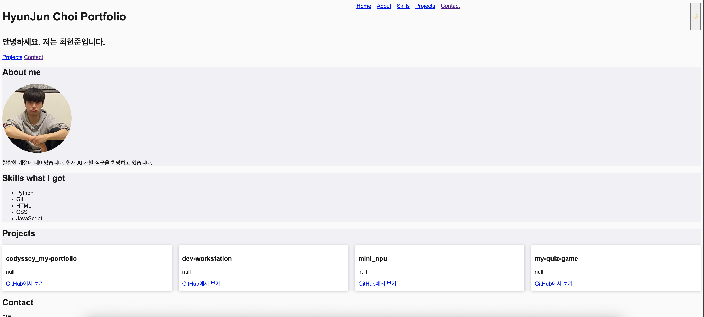
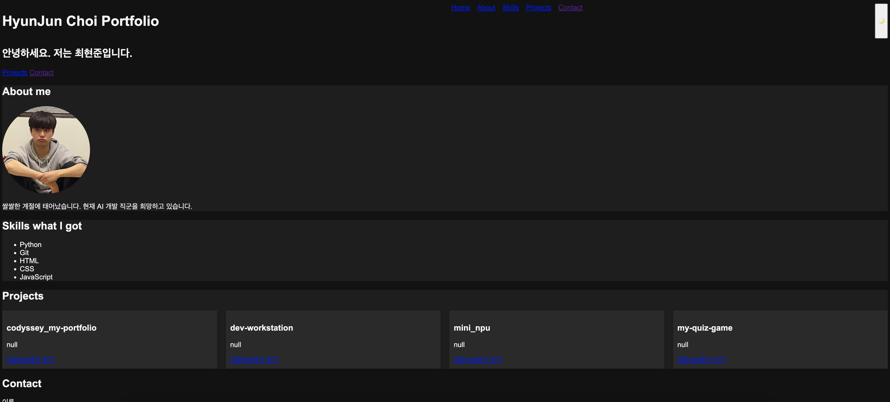
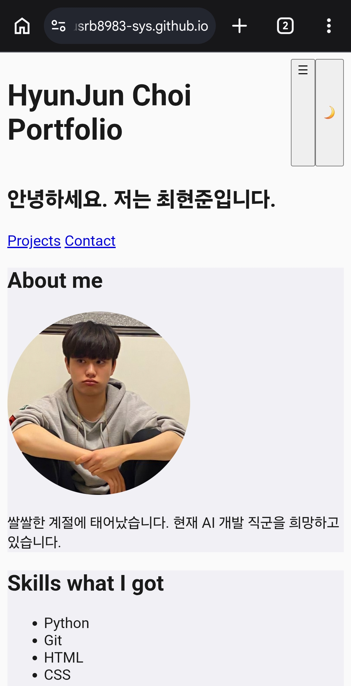

# HyunJun Choi Portfolio

외부 라이브러리 없이 순수 HTML/CSS/JavaScript만으로 만든 반응형 개인 포트폴리오 웹사이트입니다. GitHub API를 연동해 실제 저장소 목록을 동적으로 불러오며, 로딩/에러/빈 상태 처리까지 구현했습니다.

## 🔗 배포 URL

https://gusrb8983-sys.github.io/codyssey_my-portfolio/

## 🖥️ 스크린샷

### 데스크톱 (라이트 모드)


### 데스크톱 (다크 모드)


### 모바일


## 🛠️ 사용 기술

- **HTML5** — 시맨틱 마크업 (header, nav, main, section, article, footer)
- **CSS3** — CSS 변수, Flexbox, Grid, 반응형 디자인(모바일 퍼스트), 트랜지션
- **JavaScript (Vanilla)** — DOM 조작, 이벤트 처리, `async/await`를 이용한 비동기 처리
- **GitHub API** — 저장소 목록 fetch 후 동적 렌더링
- **GitHub Pages** — 정적 사이트 배포

## ✨ 주요 기능

- 다크 모드 토글 (localStorage에 저장되어 새로고침 후에도 유지)
- 모바일 햄버거 메뉴
- nav 클릭 시 부드러운 스크롤 이동
- 스크롤 위치에 따른 네비게이션 스타일 변경 및 스크롤 탑 버튼
- Intersection Observer를 이용한 스크롤 진입 애니메이션
- Contact 폼 유효성 검사 (필수값, 이메일 형식 검증)
- GitHub API 연동 Projects 섹션 (로딩 / 성공 / 에러 / 빈 상태 처리)

## 🔄 상태 관리 패턴 (이벤트 → 상태 → 렌더링)

이 프로젝트는 아래와 같은 "이벤트 → 상태 변경 → 화면 업데이트" 흐름을 여러 곳에서 사용합니다.

1. **다크 모드**: 버튼 클릭 → `data-theme` 속성 변경 → CSS 변수 기반 전체 화면 스타일 변경
2. **GitHub API 호출**: 요청 시작 → 로딩/성공/에러 상태 변경 → Projects 섹션 렌더링 변경
3. **폼 유효성 검사**: 입력/제출 → 유효성 상태(`isValid`) 변경 → 에러 메시지 표시/숨김

## 📁 폴더 구조

```
codyssey_my-portfolio/
├── index.html
├── css/
│   └── style.css
├── js/
│   └── main.js
├── images/
│   └── profile.jpg
└── screenshots/
    ├── desktop_dark.png
    ├── desktop.png
    ├── mobile_dark.png
    └── mobile.png
```

## 💡 개발 환경 및 실행 방법

1. 저장소를 clone 합니다.
   ```
   git clone https://github.com/gusrb8983-sys/codyssey_my-portfolio.git
   ```
2. VS Code로 프로젝트 폴더를 열고, `index.html`을 Live Server로 실행합니다.
3. GitHub API 호출은 인증 없이 시간당 60회 제한이 있으므로, 짧은 시간 내 반복 새로고침을 피해야 합니다.
